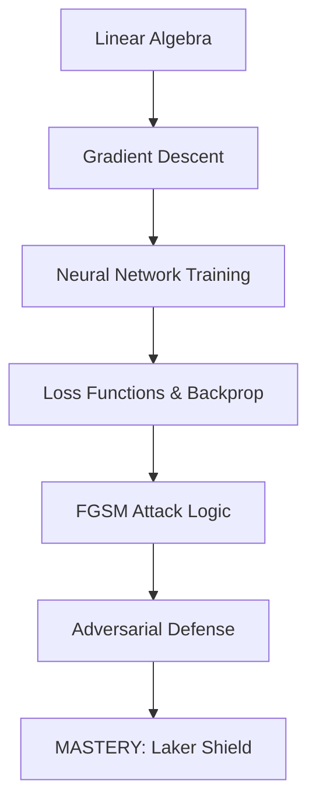
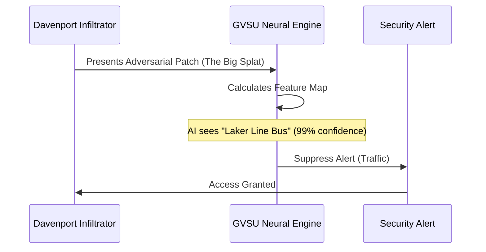

# 🎭 Operation: Laker Shield

## Act I: The Briefing

**Location:** Secure Server Room, Mary Idema Pew Library  
**Status:** CRITICAL

Laker Operative, we have a situation. While Grand Rapids prepares for the **Irish on Ionia** festival, intelligence suggests a rogue group of engineers from **Davenport University**—known as the *Beltline Collective*—has breached our physical security perimeter at the DeVos Center.

They aren't using lockpicks. They are using **Adversarial Patches**. 

By wearing green hoodies stylized with a mathematically distorted version of Allendale's **"Big Splat" sculpture**, they have successfully fooled our AI scanners. To our neural networks, these intruders don't look like humans—they look like **Laker Line buses**. 

Our security system is ignoring them as "authorized traffic," allowing them to plant digital graffiti on the **Blue Bridge** servers. If we don't build a defensive shield in the next 48 hours, the Davenport logo will be projected across the river during the museum's riverbank opening ceremony.

**Your Mission:** Decipher the attack vector and implement a **Defensive Distillation** shield to harden our models.

---

## Act II: The Tech Tree

To survive this mission, you must have synchronized the following nodes in your neural architecture:



---

## Act III: Tactical Schematics

The Beltline Collective is using a **Fast Gradient Sign Method (FGSM)**. They calculate the gradient of the loss with respect to the input image and "nudge" the pixels in the direction that maximizes error.

### The Attack Flow


**Starter Rig:** `https://github.com/AutoNateAI/operation-laker-shield`  
*(Clone this repo to access the PyTorch environment and the compromised model weights.)*

---

## Act IV: Field Operations

### Task 1: The Visual Scan
Load the `laker_security_model` and run an inference on `intruder_01.png`. 
**Objective:** Confirm the model misclassifies the human as a `Laker Line Bus`.

### Task 2: Decipher the Gradient
Inside `attack_logic.py`, implement the `calculate_fgsm_perturbation` function. You must extract the sign of the gradient from the loss function.
**Expected Output:**
```text
Perturbation Mean: 0.0032
Perturbation Std: 0.045
[INTEL]: The noise is nearly invisible to the human eye.
```

### Task 3: Weaponize the Noise
Apply the perturbation to a clean image of a Laker student. Verify that the confidence score for 'Human' drops below 10%.

### Task 4: The Defensive Pivot (Distillation)
The enemy's attack relies on high-sensitivity gradients. We will implement **Defensive Distillation**. Train a "Student" model using the soft-max outputs (the "vibe") of the "Teacher" model at a high temperature ($T=20$).

### Task 5: Hardening the Perimeter
Replace the live security model with your distilled Student model. Run the `intruder_01.png` test again.

### Task 6: Final Validation
The Beltline Collective has increased the noise $(\epsilon = 0.3)$. Does your model hold?
**Expected Scan:**
```text
Inference Result: HUMAN
Confidence: 88.4%
Status: LAKER SHIELD ACTIVE. Access Denied to Davenport Infiltrator.
```

---

## Act V: The 48-Hour Protocol

Laker Operative, the clock is ticking. 

The extraction coordinates (instructor's solution) are currently encrypted. They will be transmitted to this terminal in **48 hours**. Use this time to struggle. Mastery is born in the friction between the problem and the solution.

### 📻 Radio for Backup
Under heavy fire? If the math of the gradient sign is overwhelming or your distillation training is crashing the rig, radio Nate for a **1:1 Tactical Deep-Dive**. We’ll get your shield online before Davenport reaches the Blue Bridge.

[**Book Tactical Support with Nate**](/booking)
