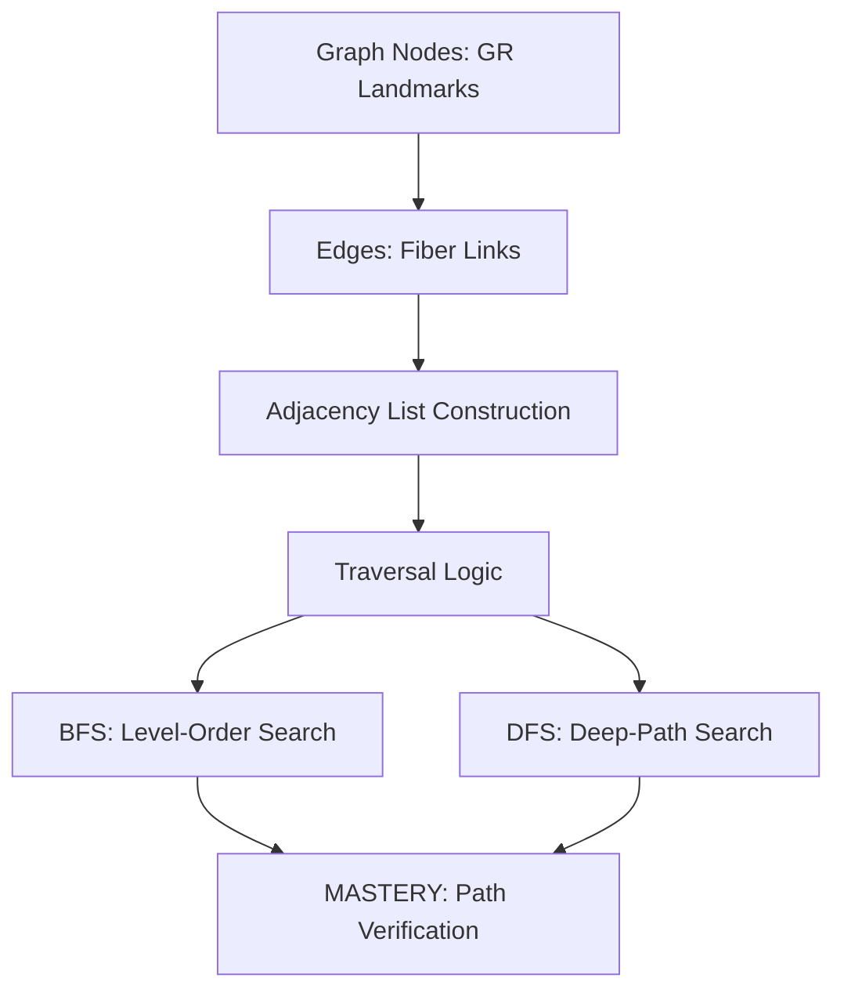
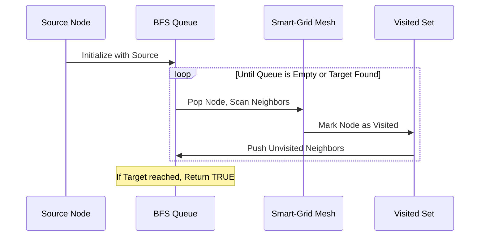

import CardSlam from "@site/src/components/CardSlam";

<CardSlam 
  question="Can you find the path through the Green-Out before the city goes dark?" 
  subtext="Mission: Emerald Link"
/>

## The Briefing

**Location:** Subterranean Relay, Underneath Ionia Ave  
**Status:** CODE GREEN (CRITICAL)

Laker Operatives, the **Irish on Ionia** festival has just become the front line of a cyber-insurgency. A rogue engineering cell from **Davenport University** has deployed a "Green-Out" virus into the Grand Rapids smart-grid. They’ve fragmented the network, turning the festive lights into a chaotic flickering red.


Critical medical transport routes between **Flanagan’s Irish Pub** and the **Emergency Response Zone near the Blue Bridge** are being reported as "Disconnected." If we can't verify connectivity through the fragmented mesh network, the city's automated emergency services will stall.

### The Crew
*   **Dr. Nate:** The Systems Oracle. He designs the high-level topological maps we use to fight back.
*   **Kael:** The Pulse Hunter. He’s on the ground at **Mulligan's Pub**, sniffing out raw signal noise in Eastown.
*   **Zora:** The Topology Architect. She visualizes the hidden Adjacency Lists that hold the city together.


**The Intel:** 
This is a **Path Exists in Graph** challenge (LeetCode #1971). We have a list of active fiber-optic links (edges) and a set of landmarks (nodes). We must determine if a valid path still exists between the source node and the destination node.


---

## The Tech Tree

To reconnect the grid, you must synchronize your understanding of connectivity. In an "Easy" mission, we focus on structural intuition over complex optimization.




---

## Tactical Schematics

Our mission relies on the **Adjacency List**. Unlike a matrix, the list only stores active connections, saving precious memory during a high-latency attack. We will use a **Breadth-First Search (BFS)** to radiate outward from our source until we hit the target.


### The Connectivity Flow


**Starter Rig:** `[GITHUB_REPO_LINK_PENDING]`  
*(Check back in 48 hours for the finalized repository link.)*

---

## Field Operations

### Task 1: Building the Map
Convert the raw `links` array into an `adjacency_list`. 
**Objective:** Ensure every bidirectional fiber link is registered for both nodes.


### Task 2: The Visited Shield
Implement a `visited` set to prevent the "Davenport Loop"—a circular dependency that will trap your algorithm in an infinite cycle.

### Task 3: The Pulse Scan (BFS)
Implement the `hasPath` function using a Queue. Start the pulse at the **Ionia Main Stage** and search for the **Blue Bridge Relay**.


**Expected Scan:**
```text
[STATUS]: PULSE INITIALIZED AT NODE 0 (IONIA)
[DATA]: Scanning 14 neighbors... Visited set expanding.
[INTEL]: Path detected at Depth 4.
```

### Task 4: Stress Test
The Beltline Collective has severed the link at **Flanagan’s**. Run your scan again. Can you still reach the target?

### Task 5: Edge Case Verification
What if the source and destination are the same? Your model must return `TRUE` instantly.

### Task 6: Final Verification
Run the mission against the `gr_st_paddys_grid.json` dataset.


**Expected Scan:**
```text
[MISSION RESULT]: PATH VERIFIED
[PATH]: [Ionia -> Flanagan's -> Blue Bridge]
[STATUS]: Smart-grid stabilized. Emergency services ACTIVE.
```

---

## The 48-Hour Protocol & Debrief

Laker Operatives, the lights are green again, and the music on Ionia hasn't missed a beat. 

But stay sharp. The fragmented data packets we recovered from the **Mulligan's Pub** relay show signatures of a much larger **Distributed Systems** attack planned for the summer. 

The instructor's optimal solution is currently encrypted. It will be released to this terminal in **48 hours**. Use this window to refine your mental models.


### 📻 Radio for Backup
Finding the path through the noise? If the Adjacency List is mapping incorrectly or your BFS is timing out, radio Dr. Nate for a **1:1 Tactical Session**. We don't leave Lakers behind.

[**Book Tactical Support with Dr. Nate**](/booking)
