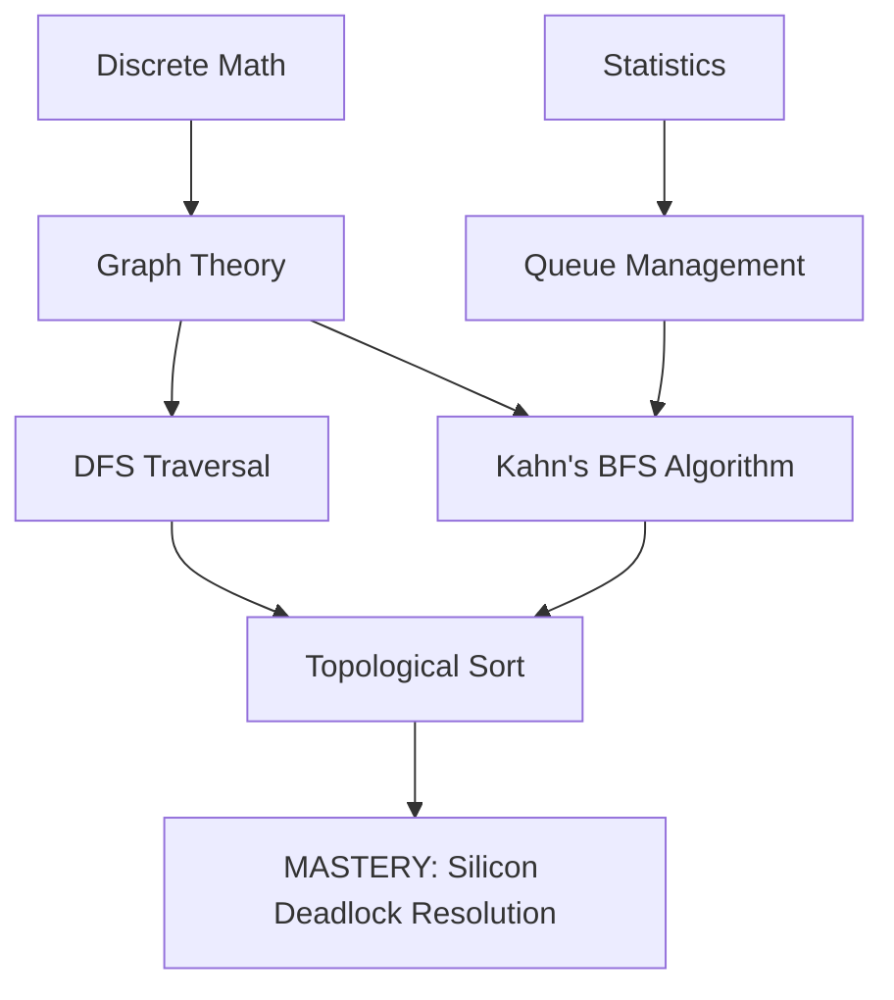
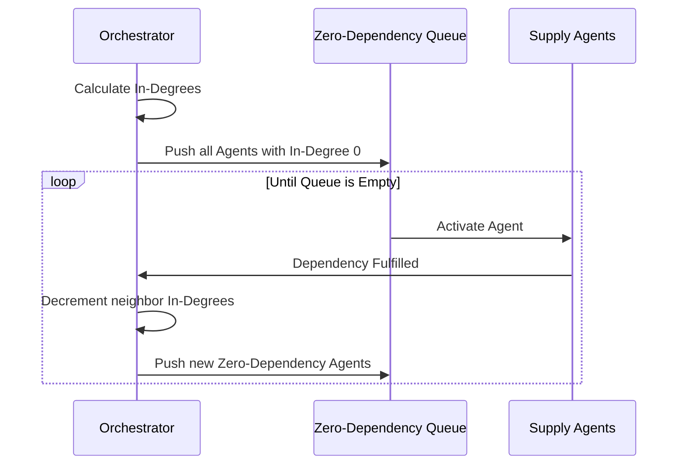

import CardSlam from "@site/src/components/CardSlam";

<CardSlam 
  question="Can you resolve a global deadlock before the AI age grinds to a halt?" 
  subtext="Mission: Silicon Deadlock"
/>

## Act I: The Briefing

**Location:** Strategic Logistics Hub, GVSU Allendale  
**Status:** EMERGENCY

Laker Operatives, listen up. The global GPU shortage has just entered a catastrophic phase. We've tracked a series of anomalous "Supply Chain Loops" that are deadlocking the delivery of H100 chips to data centers across the Midwest. 


A rogue consortium from **Davenport University** has deployed a fleet of autonomous procurement agents that have entered a cyclic dependency. Agent A won't release the HBM memory until it gets the logic boards from Agent B, but Agent B is holding the boards until Agent A provides the routing firmware. 

The entire Laker Line AI network is about to go dark.

### The Crew
*   **Maya (28):** Lead Systems Architect. She can visualize the macro-topology of entire continents in her head.
*   **Leo (22):** Rogue Data Hacker. He operates at the packet level, sniffing out cycles in real-time.
*   **Dr. Aris (38):** Silicon Logistics Expert. He knows the physical reality of every fab in Taiwan.


**The Intel:** 
This is a classic **Course Schedule II** problem (LeetCode #210). To resolve the deadlock, we must find a valid linear ordering of agent activations. If a cycle exists, the system is fundamentally broken and we must identify the source of the loop.


---

## Act II: The Tech Tree

To untangle this mess, we need to synchronize our mental models. We aren't just sorting; we are navigating a Directed Acyclic Graph (DAG).



---

## Act III: Tactical Schematics

Our mission relies on **Kahn’s Algorithm**. We track the "In-Degree" (number of incoming dependencies) for every supply agent. Any agent with zero dependencies is ready to fire.


### The Data Flow


**Starter Rig:** [https://github.com/AutoNateAI/quest-silicon-deadlock](https://github.com/AutoNateAI/quest-silicon-deadlock)  

---

## Act IV: Field Operations

### Task 1: The Initial Scan
Initialize the `AgentOrchestrator` with the total number of agents and their dependencies. 
**Objective:** Confirm you can correctly calculate the `in_degree` for the Davenport agent loop.

### Task 2: The First Activation
Implement the logic to find all agents with an in-degree of 0 and add them to your `ready_queue`.

[IMAGE 5: THE FIRST SHIFT]

**Expected Scan:**
```text
[STATUS]: READY_QUEUE INITIALIZED
[DATA]: Agents [4, 7, 12] have no prerequisites. Commencing activation.
```

### Task 3: Resolve the Deadlock
Complete the `resolve_deadlock` function. Process the queue, decrementing the in-degrees of neighbors. If your final list doesn't include all agents, you've found a cycle.

### Task 4: The Davenport Twist
A new set of "Phantom Dependencies" has appeared. These aren't just nodes—they are **Self-Referential Loops**. 


### Task 5: High-Frequency Activation (Async)
In the `SupplyChainNetwork` class, implement a logic that simulates the agents firing in parallel based on your resolved order. 


### Task 6: Final Verification
Run the mission against the `world_supply_chain.json` dataset.

[IMAGE 8: THE SHIELD GOES ONLINE]

**Expected Scan:**
```text
[MISSION RESULT]: DEADLOCK RESOLVED
[ORDER]: [0, 2, 1, 4, 3]
[STATUS]: Silicon reaching Blue Bridge servers. Laker Line RESTORED.
```

---

## Act V: The 48-Hour Protocol

Laker Operatives, the supply lines are moving, but the battle isn't over. 

The **Beltline Collective** from Davenport is already plotting their next move. The "Phantom Dependency" logs you discovered suggest a deeper conspiracy involving **System Design flaws** in the national power grid.

The extraction coordinates (instructor's solution) are currently encrypted. They will be transmitted to this terminal in **48 hours**. 


### 📻 Radio for Backup
Under heavy fire? If Kahn's Algorithm is giving you trouble or the "Phantom Loops" are crashing your rig, radio Nate for a **1:1 Tactical Deep-Dive**. 

[**Book Tactical Support with Nate**](/booking)
